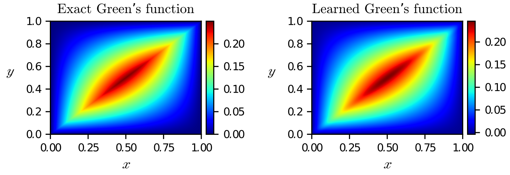
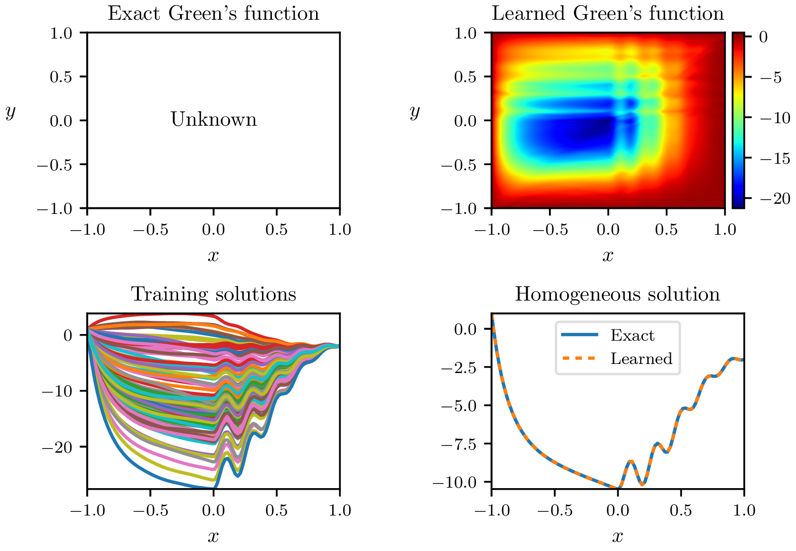

# GreenLearning

[](https://greenlearning.readthedocs.io) [](https://pypi.python.org/pypi/GreenLearning/) [](https://doi.org/10.5281/zenodo.4656020)

GreenLearning is a deep learning library based on Tensorflow for learning [Green's functions](https://en.wikipedia.org/wiki/Green%27s_function) associated with [partial differential operators](https://en.wikipedia.org/wiki/Differential_operator). 

Additional datasets are available on [Zenodo](https://doi.org/10.5281/zenodo.4656020).

|  | 
|:--:| 
| *Exact and learned Green’s function of the Laplace operator..* |

Below is an example of the Green's function of a second-order differential operator with variable coefficients learned by `GreenLearning`.

|  | 
|:--:| 
| *Learned Green’s function of a second order ODE with variable coefficients.* |

See [https://greenlearning.readthedocs.io/en/latest/gallery.html](https://greenlearning.readthedocs.io/en/latest/gallery.html) for more examples.

The library is maintained by [Nicolas Boullé](https://people.maths.ox.ac.uk/boulle/). If you are interested in using it, do not hesitate to get in contact with him at `boulle@maths.ox.ac.uk`.

**Documentation**: [ReadTheDocs](https://greenlearning.readthedocs.io/)

## Features

- GreenLearning learns Green's functions and homogeneous solutions associated with scalar and systems of linearized partial differential equations in 1D and 2D with deep learning.
- [Rational neural networks](https://proceedings.neurips.cc/paper/2020/file/a3f390d88e4c41f2747bfa2f1b5f87db-Paper.pdf) are implemented and used to increase the accuracy of the learned Green's functions.
- GreenLearning requires no hyperparameter tuning to successfully learn Green's functions.
- The neural networks can be created and trained easily with a few lines of code.
- It is simple to generate the training datasets with MATLAB scripts.

## Installation

### Requirements

GreenLearning relies on the following Python libraries:

- [TensorFlow](https://www.tensorflow.org/) >= 1.15.0
- [Matplotlib](https://matplotlib.org/)
- [NumPy](http://www.numpy.org/)
- [SciPy](https://www.scipy.org/)

### How to install GreenLearning

- For users, you can install the stable version with `pip`:
```
pip install greenlearning
```
or with `conda`:
```
conda install -c conda-forge greenlearning
```

- For developers, you should clone the GitHub repository and install it manually on your machine::
```
git clone https://github.com/NBoulle/greenlearning.git
cd greenlearning
pip install -e.
```

## Citation
Please cite the following papers if you are using GreenLearning.

- About GreenLearning:
```
@article{boulle2021data,
title={Data-driven discovery of physical laws with human-understandable deep learning},
author={Boull{\'e}, Nicolas and Earls, Christopher J. and Townsend, Alex,
journal={arXiv preprint arXiv:},
year={2021}
}
```
- About Rational neural networks:
```
@inproceedings{boulle2020rational,
title={Rational neural networks},
author={Boull{\'e}, Nicolas and Nakatsukasa, Yuji and Townsend, Alex},
booktitle = {Advances in Neural Information Processing Systems},
volume = {33},
pages = {14243--14253},
year={2020},
url = {https://proceedings.neurips.cc/paper/2020/file/a3f390d88e4c41f2747bfa2f1b5f87db-Paper.pdf}
}
```
