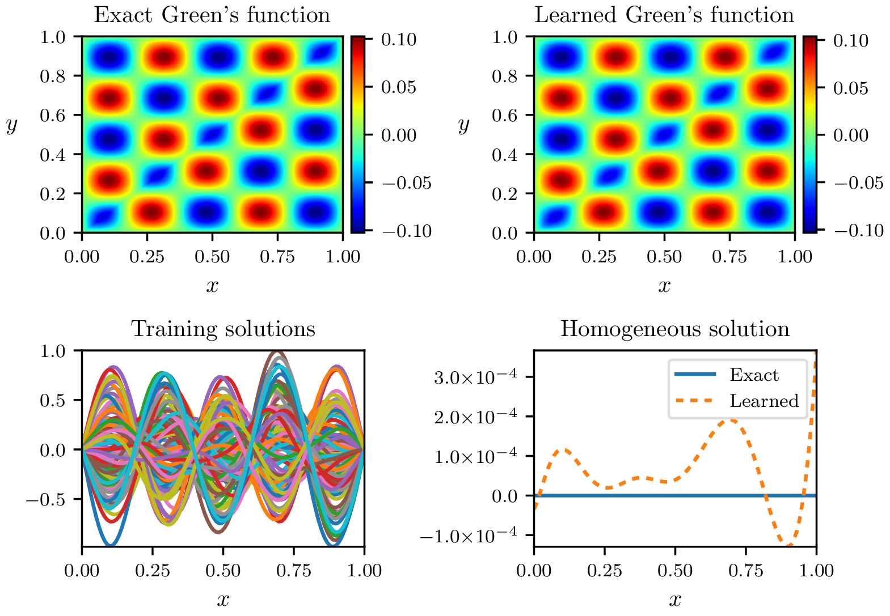

Example 1: Helmholtz operator
=============================

After generating the training dataset ``examples/datasets/helmholtz.m`` corresponding to the helmholtz operator, we now try to discover its Green's function :math:`G` and associated homogeneous solution :math:`u_{\text{hom}}` such that

.. math::
    \mathcal{L}u = f \Longleftrightarrow u(x) = \int_\Omega G(x,y)f(y)\text{d}y + u_{\text{hom}}(x),\quad \forall x\in\Omega,

where :math:`u_{\text{hom}}` is the solution to the homogeneous equation :math:`\mathcal{L}u=0` satisfying the boundary conditions.

In this example, the prescribed boundary conditions are homogeneous Dirichlet on the interval :math:`\Omega=[0,1]` and therefore :math:`u_{\text{hom}}=0`.

Training the neural networks
----------------------------

The neural networks can be implemented and trained by running the following Python script:

.. code-block:: python
    :linenos:
    
    # Import the library
    import greenlearning as gl

    # Construct neural networks for G and homogeneous solution
    G_network = gl.matrix_networks([2] + [50] * 4 + [1], "rational", (1,1))
    U_hom_network = gl.matrix_networks([1] + [50] * 4 + [1], "rational", (1,))
    
    # Define the model
    model = gl.Model(G_network, U_hom_network)
    
    # Train the model on the dataset "helmholtz" in the path "examples/datasets/"
    model.train("examples/datasets/","helmholtz")
    
    # Save the training loss
    model.save_loss()

    # Plot the results
    model.plot_results()

    # Save the NNs evaluated at a grid in a csv file
    model.save_results()
    
    # Close the TensorFlow session
    model.sess.close()

We then create one neural network for the Green's function: ``G_network``, which accepts two inputs (:math:`x,y`) and returns one output: :math:`G(x,y)`. This network has 4 hidden layers of 50 neurons each and uses rational activation functions (see the `paper <https://proceedings.neurips.cc/paper/2020/file/a3f390d88e4c41f2747bfa2f1b5f87db-Paper.pdf>`_ about rational neural networks for more details).

The last parameter of ``matrix_networks`` is the shape ``(n_output, n_input)`` corresponding to the dimension of the problem, where ``n_input`` is the number of input forcing terms :math:`f` to the system and ``n_output`` is the number of solutions :math:`u`. In this example, there is only one input and one output (as it is a scalar ODE) so we set the shape to ``(1,1)``.

The shape of the homogeneous solution network must be equal to the number of output functions :math:`u`: ``(n_output,)``.

By default, the networks are trained using first :math:`1000` steps of Adam's optimizer and then up to :math:`5\times 10^4` steps of L-BFGS-B optimizer.

Visualizing the Green's function
--------------------------------

The line

.. code-block:: python

    model.plot_results()

displays the learned Green's function (top-right panel), the training solutions :math:`u` used (bottom-left), and the learned homogeneous solution (bottom-right) in the file ``results/helmholtz_rational.pdf``.

|helmholtz_rational|

.. centered:: *Exact and learned Green's function of the Helmholtz operator using a rational neural network.*

- Using rational neural networks for both the Green's function and homogeneous solution, we achieve a relative error between the exact and learned Green's function of :math:`0.9\%`. The relative error is defined as

.. math::
    \text{Relative error} = \frac{\|G_{\text{exact}} - G_{\text{learned}}\|_{L^2(\Omega)}}{\|G_{\text{exact}}\|_{L^2(\Omega)}}

- The values of the loss function during the training process are saved in the following file: ``training/loss_rational.csv``.

ReLu vs Rational neural network
-------------------------------

We can also specify a different activation function, (e.g. ReLU) for the neural networks easily as

.. code-block:: python

    # Construct neural networks for G and homogeneous solution
    G_network = gl.matrix_networks([2] + [50] * 4 + [1], "relu", (1,1))
    U_hom_network = gl.matrix_networks([1] + [50] * 4 + [1], "relu", (1,))

and we obtain the following figure.

|helmholtz_relu|

.. centered:: *Exact and learned Green's function of the Helmholtz operator using a ReLU neural network.*

Here, the relative error reaches :math:`5.3\%`, which is significantly larger than the one obtained with rational neural networks. In addition, the Green's function and homogeneous solution learned with ReLU networks are not necessarily smooth as shown by the figure above.
