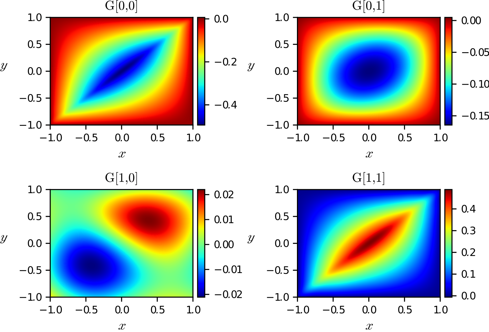
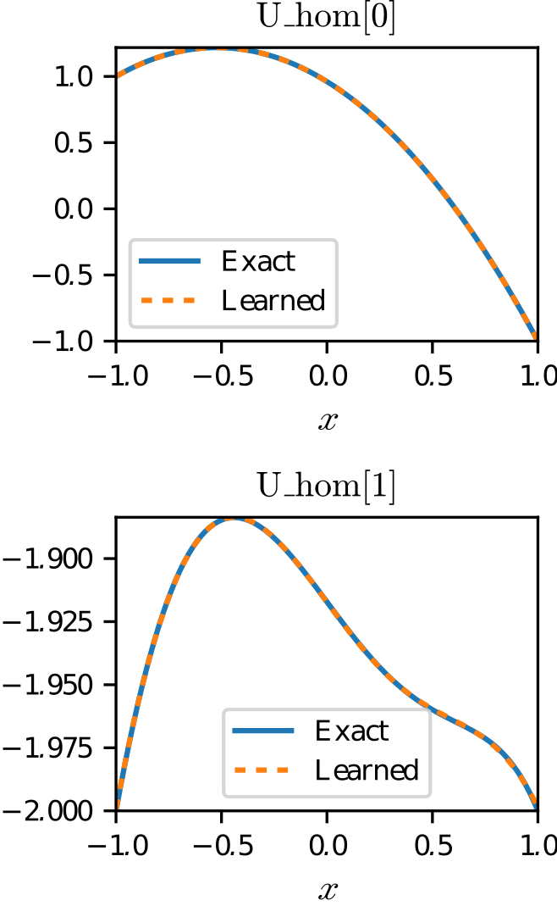

Example 2: System of ODEs
=========================

In this example, we learn a matrix :math:`G` of Green's functions and homogeneous solutions :math:`(u_{\text{hom}},v_{\text{hom}})` associated to the system of differential operators:

.. math::

    \mathcal{L}(u,v) = \left(\begin{array}{c} \frac{d^2u}{dx^2}-v\\
                                     -\frac{d^2v}{dx^2}+xu
                       \end{array}\right),

on the domain :math:`[-1,1]` with boundary conditions:

.. math::

    u(-1)=1,\,u(1)=-1,\,v(-1)=v(1)=-2.

Hence, if :math:`f_1` and :math:`f_2` are two forcing terms, then the solution :math:`(u,v)` to the equations

.. math::

    \begin{align}
    \frac{d^2u}{dx^2}-v &= f_1,\\
    -\frac{d^2v}{dx^2}+xu &= f_2,
    \end{align}

satisfies

.. math::

    \begin{pmatrix}
    u(x)\\
    v(x)
    \end{pmatrix}
    =
    \int_{[-1,1]}
    \begin {pmatrix}
    G_{0,0}(x,y) & G_{0,1}(x,y)\\
    G_{1,0}(x,y) & G_{1,1}(x,y)\\
    \end{pmatrix}
    \begin{pmatrix}
    f_1(y)\\
    f_2(y)
    \end{pmatrix}
    \text{d} y
    +
    \begin{pmatrix}
    u_{\text{hom}}(x)\\
    v_{\text{hom}}(x)
    \end{pmatrix},

for all :math:`x\in[-1,1]`. Note that we have employed the Python indexing notation for matrices. Moreover, the homogeneous solutions satisfy the following equations:

Implementation
--------------

We implement this example in ``GreenLearning`` by running the following Python script:

.. code-block:: python
    :linenos:
    
    # Import the library
    import greenlearning as gl

    # Construct neural networks for G and homogeneous solution
    G_network = gl.matrix_networks([2] + [50] * 4 + [1], "rational", (2,2))
    U_hom_network = gl.matrix_networks([1] + [50] * 4 + [1], "rational", (2,))
    
    # Define the model
    model = gl.Model(G_network, U_hom_network)
    
    # Train the model on the dataset "ODE_system" in the path "examples/datasets/"
    model.train("examples/datasets/","ODE_system")
    
    # Plot the results
    model.plot_results()
    
    # Close the Tensorflow session
    model.sess.close()

In particular, we defined the shape of the matrix of neural networks ``G_network`` to be ``(2,2)`` because there are two input functions :math:`(f_1,f_2)`, and two outputs :math:`(u,v)`. Similarly, the homogeneous solution network ``U_hom_network`` has shape ``(2,)`` to match the number of outputs.

Numerical results
-----------------

In the script written above, we used the following command to plot the Green's function and save the results:

.. code-block:: python

    # Plot the results
    model.plot_results()

Note that this command differs to the case of scalar operator (i.e. one input and output function) as it displays the matrix of Green's functions and the two homogeneous solutions.

|ODE_system_rational_Green| |ODE_system_rational_Hom|

.. centered:: *Matrix of Green's functions together with homogeneous solutions learned by a rational neural network.*

In this figure, we recognize the diagonal blocks of the matrix of Green's functions, which correspond to the Laplacian and negative Laplacian operator. We also see on the right panel that the homogeneous solutions to the system of ODEs are learned by the rational neural networks with high accuracy.