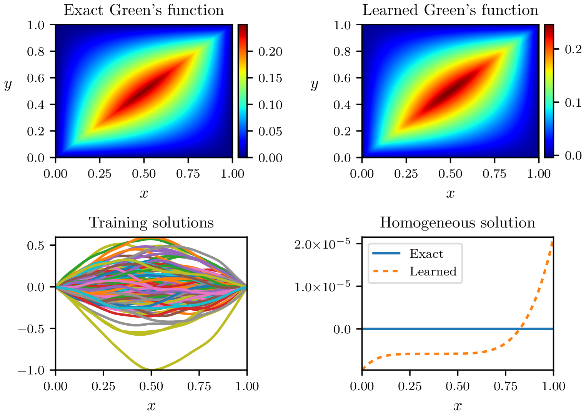

Gallery of examples
===================

In this section, we display the Green's functions of the examples located in ``examples/`` learned by GreenLearning. Each title is a link to the corresponding MATLAB script.

`advection_diffusion <https://github.com/NBoulle/greenlearning/blob/main/examples/advection_diffusion.m>`_
--------------------

|advection_diffusion|

`advection_diffusion_jump <https://github.com/NBoulle/greenlearning/blob/main/examples/advection_diffusion_jump.m>`_
--------------------

|advection_diffusion_jump|

`airy_equation <https://github.com/NBoulle/greenlearning/blob/main/examples/airy_equation.m>`_
--------------------

|airy_equation|

`biharmonic <https://github.com/NBoulle/greenlearning/blob/main/examples/biharmonic.m>`_
--------------------

|biharmonic|

`boundary_layer <https://github.com/NBoulle/greenlearning/blob/main/examples/boundary_layer.m>`_
--------------------

|boundary_layer|

`cubic_helmholtz <https://github.com/NBoulle/greenlearning/blob/main/examples/cubic_helmholtz.m>`_
--------------------

|cubic_helmholtz|

`cusp <https://github.com/NBoulle/greenlearning/blob/main/examples/cusp.m>`_
--------------------

|cusp|

`dawson <https://github.com/NBoulle/greenlearning/blob/main/examples/dawson.m>`_
--------------------

|dawson|

.. |dawson| image:: ../images/dawson_rational.png
   :width: 100%

`helmholtz <https://github.com/NBoulle/greenlearning/blob/main/examples/helmholtz.m>`_
--------------------

|helmholtz|

.. |helmholtz| image:: ../images/helmholtz_rational.png
   :width: 100%

`identity <https://github.com/NBoulle/greenlearning/blob/main/examples/identity.m>`_
--------------------

|identity|

`interior_layer <https://github.com/NBoulle/greenlearning/blob/main/examples/interior_layer.m>`_
--------------------

|interior_layer|

`jump_green <https://github.com/NBoulle/greenlearning/blob/main/examples/jump_green.m>`_
--------------------

|jump_green|

`laplace <https://github.com/NBoulle/greenlearning/blob/main/examples/laplace.m>`_
--------------------

|laplace|

`mean_condition <https://github.com/NBoulle/greenlearning/blob/main/examples/mean_condition.m>`_
--------------------

|mean_condition|

`negative_helmholtz <https://github.com/NBoulle/greenlearning/blob/main/examples/negative_helmholtz.m>`_
--------------------

|negative_helmholtz|

`nonlinear_biharmonic <https://github.com/NBoulle/greenlearning/blob/main/examples/nonlinear_biharmonic.m>`_
--------------------

|nonlinear_biharmonic|

`nonlinear_SL <https://github.com/NBoulle/greenlearning/blob/main/examples/nonlinear_SL.m>`_
--------------------

|nonlinear_SL|

`periodic_helmholtz <https://github.com/NBoulle/greenlearning/blob/main/examples/periodic_helmholtz.m>`_
--------------------

|periodic_helmholtz|

`potential_barrier <https://github.com/NBoulle/greenlearning/blob/main/examples/potential_barrier.m>`_
--------------------

|potential_barrier|

`schrodinger <https://github.com/NBoulle/greenlearning/blob/main/examples/schrodinger.m>`_
--------------------

|schrodinger|

.. |schrodinger| image:: ../images/schrodinger_rational.png
   :width: 100%

`third_order <https://github.com/NBoulle/greenlearning/blob/main/examples/third_order.m>`_
--------------------

|third_order|

`variable_coeffs <https://github.com/NBoulle/greenlearning/blob/main/examples/variable_coeffs.m>`_
--------------------

|variable_coeffs|

.. |variable_coeffs| image:: ../images/variable_coeffs_rational.png
   :width: 100%

`viscous_shock <https://github.com/NBoulle/greenlearning/blob/main/examples/viscous_shock.m>`_
--------------------

|viscous_shock|

